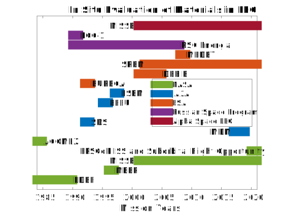

---
title: In-Situ Material Evaluation
layout: template
filename: insitu
--- 
# Timeline of In Situ Evaluation Missions

The figure below displays a timeline of missions from various space agencies and companies during which materials were evaluated directly in the LEO environment (in situ). More details on the missions are provided in [on this page](https://spaceborne-pcms.github.io/qualification).

## Definitions of Acronyms

### Alpha Space, LLC

MISSE: Materials International Space Station Experiment

### Russion Space Program

RCC-1: Mission for the Russion Space Program operating from 1990 to 1991.

RSC Energia: Program with the Russion Space Program from 1990 to 2008.

### European Space Agency (ESA)

MEDET: Materials Exposure and Degredation Experiment

SREM: Standard Radiation Environment Monitor

DEBIE: Debris in Orbit Evaluation

EURECA: European Retrievable Carrier

### Japan Aerospace Exploration Agency (JAXA)

ESEM: Evaluation of the Space Environment and Effects on Materials

EFFU: Exposed Facility Flyer Unit

SDS: Small Demonstration Satellite

### National Aeronautics and Space Administration (NASA)

ACOMEX: Advanced Composite Materials Exposure to Space Environment

EPSCoR: Established Program to Stimulate Competetive Research

ISS: International Space Station

MEEP: Mir Environmental Effects Payload

LDEF: Long Duration Exposure Facility