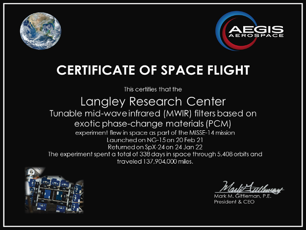

---
title: MISSE-14 Results
layout: template
filename: misseresults
--- 

Results coming soon (under NASA review for public release).

*On February 20th, 2021, a Northrup Grumman (NG) Cygnus spacecraft delivered twenty-four PCM specimens including PCM-based MWIR filters for 6-months of exposure to the space environment. After system check-out, on April 8th, JAXA astronaut Soichi Noguchi installed the MISSE-14 Science Carriers (MSC) on the MISSE Transfer Tray (MTT) and placed it on the Japanese Experiment Module (JEM) ORU Transfer Interface (JOTI) inside the JEM airlock. The follow-up depressurization of the JEM airlock was completed on April 16th. MISSE-14 installation on the MISSE-Flight Facility (MISSE-FF) was completed on April 25th and the MSCs were opened to start the PCMs expose in space on June 21st. High-resolution cameras (owned by Aegis Aerospace Inc.)  scanned and captured photographs of the samples about once a month to detect changes as a function of time from July 21st to December 6th.  Along with the science data, temperature, UV radiation, and total ionizing radiation doses were measured on-orbit. MISSE-14 completed the final closing of the MSCs on December 26th with a total open exposure time of 133 days 5 hours, 6 minutes on Wake and 148 days 21 hours 11 minutes on Zenith directions, respectively. MISSE-14 MSCs were removed from the MISSE-FF from December 26-28 with the support of the Canada Space Agency (CSA) ISS Robotic Systems Team. The MISSE-14 MSCs entered the Japanese Module Airlock (JEM) on December 29th that was repressurized on December 31st. Finally, the MSCs were packed by ISS Crew members Kayla Barron and Mark Vande Hei. MISSE-14 returned on SpaceX CRS-24 (also known as SpX-24) on January 25th, 2022. The PCMs arrived at Aegis Aerospace two weeks after splashdown for de-integration. Finally, all samples were returned to NASA LaRC in March 2022 for post flight characterization similarly to the preflight characterization conducted before launch.*

