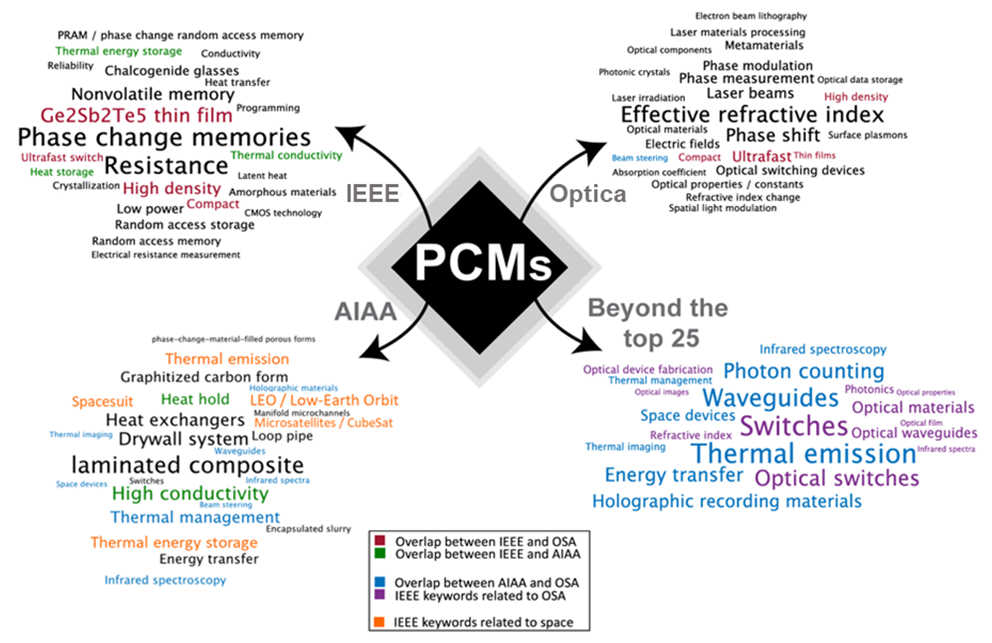

---
title: Research Trends Toward Space
layout: template
filename: researchtrends
--- 

# Research Trends Toward Outer Space

## What evidence is there that PCM research can, and should, expand from terrestrial to space applications? 

The concept of applying different, non-chalcogenide PCMs to space applications is not entirely unheard of. Since the 1970s1, gallium and paraffin materials (materials with a solid-liquid phase changes) have been proposed and tested for spacecraft thermal control in LEO or lunar orbit2-4. Moreover, these PCMs have been proposed for in situ thermometry calibration references in space5,6. In 2014, semiconductor-to-metal transition (SMT) between monoclinic and tetragonal structures of vanadium dioxide (VO2) was studied for the passive control of the internal temperature of spacecraft7 as a first version of an all-solid-state device platform. These space applications of gallium- and paraffin-based PCMs are due to the robust characteristics and low weight of the materials. However, to-date, the application of all-solid-state, and particularly chalcogenide, PCMs for space applications has been largely non-existent. 

Recent trends and advances of PCM-integrated devices that could have relevance for spaceborne applications are highlighted through a keyword searching techniques, both the search services (RIS format in particular) and Python search script ([Click to access PDF file](keyword_search_method.pdf)), with ‘phase change material’ as the key phrase. Figure 1 shows the 25 keywords appearing the most frequently when coupled with ‘phase change material’, where the keyword size represents the relative appearance frequency. These words are from Institute of Electrical and Electronics Engineers (IEEE), American Institute of Aeronautics and Astronautics (AIAA), and Optica (formerly OSA) publications between 2004–2022. The IEEE, AIAA, and Optica focus on electronics-, aerospace-, and optics-related issues, respectively. Looking specifically at the AIAA paper archive, we observe that current and future mission platforms are moving away from large platforms with less-stringent Size, Weight, and Power (SWaP) requirements, towards smaller platforms (such as microsatellite/CubeSat) that require a miniaturization of measurement equipment in low Earth orbit (LEO), and have an increased emphasis on temperature management (as their small size means their temperatures will swing more rapidly and dramatically as they move into and out of direct sunlight).

From Figure, we can see that the following keywords are among those shared by at least two of the three publishers: ultrafast switch, high density, compact, thin film, and phase modulation.  All these are terms relevant to the potential use of PCM optical elements (lenses, filters, and beam steerers for imaging, LIDAR, and spectroscopy systems, etc.) in spacecraft systems with stringent SWaP requirements.

From the overlapping keywords between AIAA and OSA (highlighted in blue) and IEEE keywords related to Optic (highlighted in purple) in Figure 1, we can see the following keywords: waveguides, beam steering, infrared spectroscopy, switches, holographic material, and thermal imaging. All these technologies/sub-systems are reflected in terrestrial applications including optical communication, mobile imaging, augmented and virtual reality (AR/VR), and automotive sensing. The technology’s emergence as highly promising reconfigurable photonics components opens up a variety of new space applications where adaptable modulation and switching are needed such as reconfigurable beam steering and active on/off switches for LIDAR. Furthermore, for terrestrial applications, passive systems (i.e., stepper motors for beam steering and switches) are readily adapted for tuning systems.  However, mechanical failure, limited cycling/lifetime, and high-volume device manufacturing and packaging face challenges when it comes to space applications. Recently, PCMs have been investigated in various nanophotonic platforms such as photonic integrated circuits14 and metasurfaces8-9, suggesting that they can play a critical role in miniaturizing current spaceborne components and subsystems and allow them to fit into much more compact form-factors such as microsatellites.

Another benefit of analyzing the AIAA paper archive is to find the trends of PCM uses or applications in aerospace or aeronautical fields. Since aerospace engineering requires state-of-the-art applications of materials used in aircraft or spacecraft, estimation of the newest trend in chalcogenide PCM use can be important information that can help direct (or allocate) future space research resources optimally beyond the bounds of electronics or optics applications. The “thermal emission”, “spacesuit”, “LEO / low-earth orbit”, “microsatellite / CubeSat”, and “thermal energy storage” are keywords within the first 25 words with frequency counts out of the total search results. From this, it can be deduced that the newest applications for PCMs include satellite temperature homeostasis and solar / solar-thermal energy systems, particularly those benefiting from engineering the thermal emission of PCMs10-12. 

PCMs’ non-volatile, reconfigurable, and fast-switching characteristics are an enabling technology for a variety of solid-state sub-systems mentioned previously. Later in this comment, we will introduce application-driven examples based on specific NASA space science missions and programs related to the keywords of “spectroscopy”, “optical switches”, and “thermal imaging.”

**Figure. keyword survey to show research trend of PCMs toward space applications.**
The 25 keywords listed the most frequently with the phrase “phase change material” as obtained from IEEE, AIAA, and Optica publications between the years 2004 to 2022. The overlapping keywords are “ultrafast switch”, “high density”, “compact”, “thin film”, and “phase modulation”. All these are terms relevant to the potential use of PCM-based optical elements in spacecraft systems with stringent SWaP requirements. Note that the keyword size is proportional to the appearance frequency.

References
1.	Kelliher, W. C. et al. NASA TN D-6756, https://ntrs.nasa.gov/citations/19720018274 (1972). 
2.	Howes, A. et al. Adv. Optical Mater. 8 (4), 1901479 (2019).
3.	Quinn, G. Hodgson, E. & Stephan, R. AIAA 2011-5229 (2011).
4.	Choi, M. K. AIAA 2012-3894 (2012). 
5.	Pearce, J. V. et al. Meas. Sci. Technol. 30, 124003 (2019).
6.	F. A. et al. Proceedings of SPIE, 78570J, https://doi.org/10.1117/12.869564 (2010).
7.	Leahu, G. L. et al. AIP conference proceedings, 1603, 62, https://doi.org/10.1063/1.4883043 (2014).
8.	Gu, T. et al. Nature Photon. in processing, “Active metasurfaces: lighting the path to a sparkling success”, https://arxiv.org/abs/2205.14193 (2022).
9.	Zhang, Y. et al. Nat. Nanotechnol. 16, 661–666 (2021).
10.	Xu, J., Mandal, J., & Raman, A. P., Science 372 (654), 393–397 (2021).
11.	Qu, Y. et al. Light Sci.& Appl. 7, 26 (2018).
12.	Sheng, X. et al. Nature Materials. 13, 593-598 (2014).

