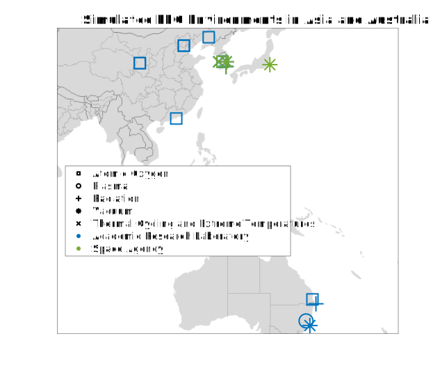
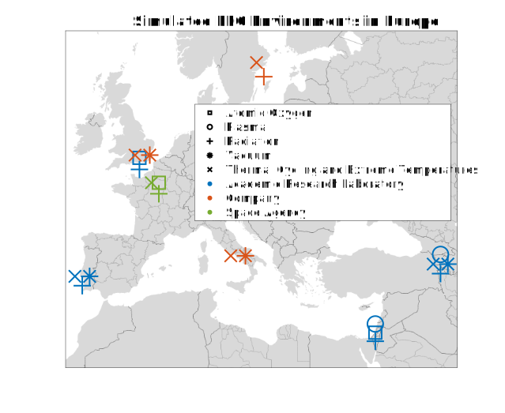
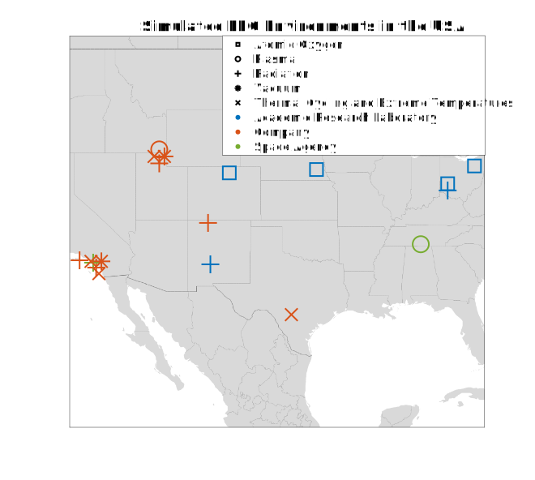

# Locations of Facilities for Evaluation of Materials in Simulated LEO Conditions

Universities, companies, and space agencies from across the globe have studied materials in simulated LEO conditions. Below are maps that details the locations of the organizations that have carried out these types of studies. Please note that this information is expansivee but not all-inclusive; many organizations have studied materials in LEO-like conditions; but the list serves as a useful reference as opposed to an all-ecompasing list.

In each figure, the color of the marker indicates the type of organization (academic research laboratory, company, or space agency). The shape of the marker indicates what aspect of the LEO environment is/was simulated (atomic oxygen, plasma, radiation, vacuum, or thermal cycling/temperature extremes).

